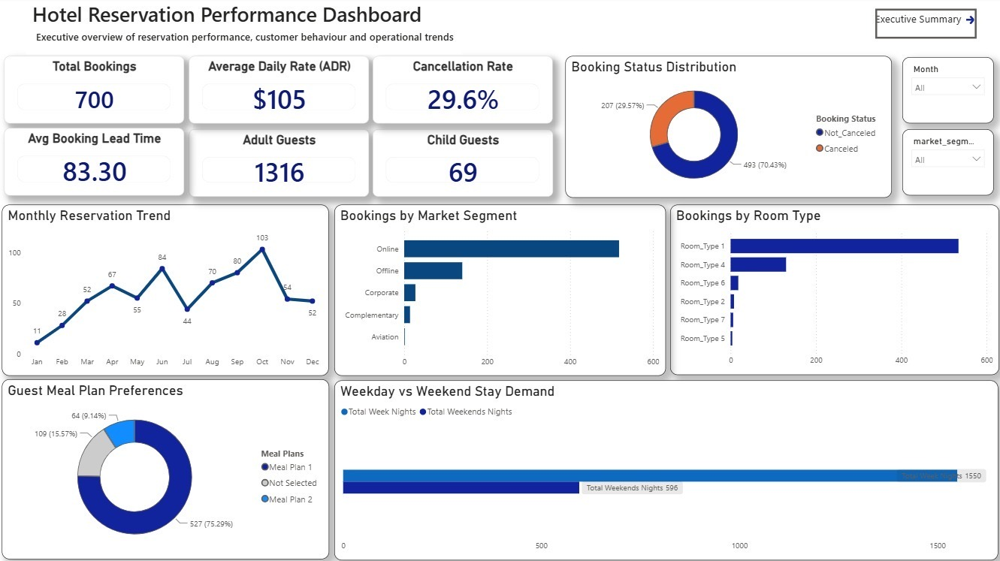

🏨 Hotel Reservation Performance Dashboard

End-to-End Business Intelligence Project | SQL • Power BI • DAX • Power Query • Excel

⸻

## 📊 Dashboard Preview

⸻

## 📈 Executive Findings & Strategic Recommendations

.

⸻

📑 Table of Contents

* Project Overview
* Business Problem
* Business Objectives
* Tools & Technologies
* Project Workflow
* Business Questions Answered
* Dashboard Features
* Key Business Insights
* Business Impact
* Skills Demonstrated
* Repository Structure
* Conclusion

⸻

📌 Project Overview

This project demonstrates an end-to-end Business Intelligence solution designed to help hotel management monitor reservation performance and make informed business decisions.

Using SQL, Power BI, DAX, Power Query, and Excel, raw reservation data was transformed into an interactive dashboard supported by executive insights and strategic recommendations.

The project focuses on identifying booking trends, customer preferences, cancellation risks, and operational opportunities that can improve overall business performance.

⸻

🏨 Business Problem

Hotels generate large volumes of reservation data every day. Without proper analysis, management may struggle to identify booking trends, understand customer behaviour, monitor cancellations, and make informed operational decisions.

This project was developed to transform raw reservation data into meaningful insights that support strategic planning and improve decision-making.

⸻

🎯 Business Objectives

* Monitor overall reservation performance.
* Analyse booking trends over time.
* Measure cancellation rates and potential revenue risk.
* Identify the most preferred room types and meal plans.
* Understand booking channel performance.
* Support management with interactive dashboards and actionable recommendations.

⸻

🛠️ Tools & Technologies

Tool	Purpose
SQL	Business analysis and querying
Power BI	Interactive dashboard development
DAX	KPI calculations and measures
Power Query	Data cleaning and transformation
Microsoft Excel	Source dataset

⸻

🔄 Project Workflow

Raw Reservation Dataset
          │
          ▼
SQL Business Analysis
          │
          ▼
Power Query
(Data Cleaning & Transformation)
          │
          ▼
Data Modelling
          │
          ▼
DAX Measures & KPIs
          │
          ▼
Interactive Power BI Dashboard
          │
          ▼
Executive Insights
          │
          ▼
Business Recommendations

⸻

❓ Business Questions Answered

The SQL analysis addressed key business questions, including:

* What is the total number of hotel reservations?
* What percentage of reservations were cancelled?
* What is the average room price?
* What is the average booking lead time?
* Which month recorded the highest booking demand?
* Which booking channel generated the highest reservations?
* Which room type is most preferred?
* Which meal plan is most popular?
* How do weekday and weekend stays compare?
* What opportunities exist to improve hotel performance?

⸻

📈 Dashboard Features

Reservation Performance Dashboard

The dashboard includes:

* Total Reservations
* Cancellation Rate
* Average Daily Rate (ADR)
* Average Booking Lead Time
* Monthly Reservation Trend
* Booking Distribution by Market Segment
* Reservation Status Analysis
* Room Type Demand
* Meal Plan Preferences
* Weekday vs Weekend Stay Analysis

⸻

Executive Findings

The executive summary highlights:

* Booking demand trends
* Customer preferences
* Revenue risk from cancellations
* Market performance
* Operational performance

⸻

Strategic Recommendations

Recommendations focus on:

* Revenue optimisation
* Cancellation reduction strategies
* Marketing channel performance
* Capacity planning
* Demand forecasting

⸻

💡 Key Business Insights

* Reservation demand remained stable throughout the year, with October recording the highest booking volume.
* Online bookings generated the highest number of reservations, making digital channels the strongest source of customer acquisition.
* Nearly 30% of reservations were cancelled, representing a significant opportunity to reduce revenue leakage.
* Room Type 1 and Meal Plan 1 were consistently the most popular customer choices.
* Booking lead time provides valuable insight for forecasting demand and improving operational planning.

⸻

📈 Business Impact

The insights generated from this project can help hotel management:

* Improve pricing strategies during periods of high demand.
* Reduce revenue loss caused by reservation cancellations.
* Allocate rooms more efficiently.
* Strengthen digital marketing channels.
* Improve forecasting and resource planning.
* Support data-driven decision-making across hotel operations.

⸻

🚀 Skills Demonstrated

* SQL Query Writing
* Data Cleaning
* Data Transformation
* Data Modelling
* DAX Measures
* KPI Development
* Power BI Dashboard Design
* Executive Reporting
* Business Intelligence
* Data Storytelling
* Business Analysis

⸻

📁 Repository Structure

Hotel-Reservation-Performance-Dashboard
│
├── README.md
├── Hotel_Reservation_Performance_Dashboard.pbix
├── Hotel_Reservation_SQL_Analysis.sql
├── Hotel_Reservation_Database.sql
├── Reservation_Performance_Dashboard.png
└── Executive_Findings_Recommendations.png

⸻

📌 Conclusion

This project demonstrates the complete Business Intelligence lifecycle—from querying raw reservation data with SQL to transforming and modelling the data, building interactive Power BI dashboards, and delivering executive insights with actionable business recommendations.

The goal was not only to build a dashboard but to communicate meaningful insights that support strategic decision-making in the hospitality industry.

⸻

👨‍💻 Author

Emmanuel Akingbade

Aspiring Data Analyst with a passion for transforming raw data into actionable business insights through SQL, Power BI, DAX, Power Query, and Excel.

Thank you for visiting this repository. Feedback and suggestions are always welcome
